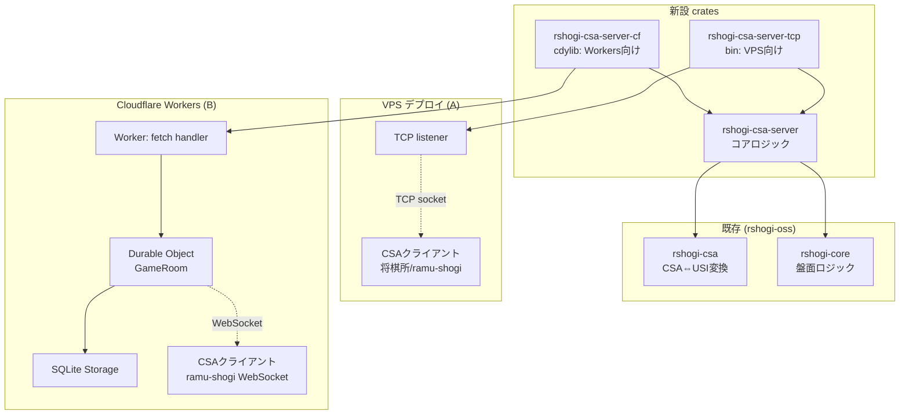

# rshogi-csa-server 設計ドキュメント

## 1. 目的と背景

### 1.1 ゴール

- CSA プロトコル準拠の将棋対局サーバーの Rust 実装を提供する
- **1つのコア crate を TCP 版と Cloudflare Workers 版の両方のフロントエンドから使える**ように設計する
- 既存 Ruby 製 `shogi-server` の負荷問題（Floodgate の安定性）を Rust で改善する
- CSA クライアント（将棋所、ramu-shogi 等）の互換サーバーとして動作可能にする

### 1.2 想定ユースケース

- **TCP 版 (A)**: VPS にデプロイし、Floodgate の代替として既存 CSA クライアントから接続される
- **CF Workers 版 (B)**: ramu-shogi 等の自前クライアントと WebSocket で接続し、サーバーレス運用
- **ハイブリッド**: 同じ対局ロジックを維持しつつ、配信レイヤーだけを用途に応じて切り替える

### 1.3 非ゴール

- エンジン思考処理（評価関数、探索）は本 crate のスコープ外
- レート計算バッチ（mk_rate 相当）は別プロセスとして独立
- 管理 UI は別プロジェクト

---

## 2. 技術要素と最新バージョン（調査済み公式情報）

| 技術 | 最新版 | 採用理由 |
|------|--------|---------|
| **workers-rs** | v0.8.0 (2026-04-10) | Cloudflare 公式 Rust SDK。Durable Objects / WebSocket Hibernation / SQLite Storage / Alarms / axum 統合対応 |
| **Axum** | v0.8.9 (2024-04-14) | `extract::ws` で WebSocket サポート、CF Workers 公式 example あり、`default-features=false` で WASM 対応 |
| **tokio** | v1.x | TCP 版で `net`, `macros`, `sync`, `rt-multi-thread` features を使用。Workers 版では使わない |
| **workers-rs 0.8 features** | `http`, `axum` | `#[event(fetch)]` で axum Router を呼び出せる |
| **Durable Object storage** | SQLite backend | 対局 ID 決定論的ルーティング、棋譜 10GB まで保存可、Point-in-Time Recovery 30 日 |
| **WebSocket Hibernation** | `state.accept_web_socket()` | アイドル時の GB-s 課金ゼロ、秒読み中の長時間接続でもコスト最小 |
| **Alarms API** | ミリ秒粒度、通常数 ms 内発火 | 時間切れ判定に使用（UI 表示は別） |

### 2.1 Rust バージョン要件
- MSRV: **Rust 1.80**（Axum 0.8 要件）
- edition: 2021（workspace 統一）
- Cloudflare Workers ターゲット: `wasm32-unknown-unknown`

### 2.2 主要参考資料
- workers-rs: https://github.com/cloudflare/workers-rs/releases/tag/v0.8.0
- Axum WebSocket: https://docs.rs/axum/latest/axum/extract/ws/
- workers-rs axum example: https://github.com/cloudflare/workers-rs/tree/main/examples/axum
- Durable Objects WebSocket Hibernation: https://developers.cloudflare.com/durable-objects/best-practices/websockets/
- CSA Server Protocol v1.2.1: http://www2.computer-shogi.org/protocol/
- CSA 棋譜形式 V2.2: http://www2.computer-shogi.org/protocol/record_v22.html

---

## 3. アーキテクチャ全体図



**設計の肝**: `rshogi-csa-server` crate は I/O から完全に独立。送受信は `Transport` trait で抽象化し、TCP/WebSocket 具体実装をフロントエンド側に委譲する。

---

## 4. Crate 構成

```
rshogi-oss/
├── crates/
│   ├── rshogi-core/              (既存)
│   ├── rshogi-csa/               (既存 - CSA⇔USI変換)
│   ├── rshogi-usi/               (既存)
│   ├── tools/                    (既存)
│   │
│   ├── rshogi-csa-server/        ★新設: コアロジック
│   │   ├── Cargo.toml
│   │   └── src/
│   │       ├── lib.rs
│   │       ├── transport.rs      — Transport trait
│   │       ├── protocol/
│   │       │   ├── mod.rs
│   │       │   ├── command.rs    — コマンドパーサ
│   │       │   ├── login.rs      — LOGIN行パース
│   │       │   ├── game_summary.rs — Game_Summary組立
│   │       │   └── game_result.rs — 終局メッセージ
│   │       ├── game/
│   │       │   ├── mod.rs
│   │       │   ├── room.rs       — GameRoom (対局1つ)
│   │       │   ├── time_clock.rs — ChessClock/Fischer/StopWatch
│   │       │   ├── state.rs      — プレイヤ状態機械
│   │       │   └── validator.rs  — 指し手検証・千日手・入玉宣言
│   │       ├── matching/
│   │       │   ├── mod.rs
│   │       │   ├── league.rs     — ログイン中プレイヤ管理
│   │       │   ├── pairing.rs    — LeastDiff/Swiss/Random
│   │       │   └── floodgate.rs  — 定期マッチメイク
│   │       ├── record/
│   │       │   ├── mod.rs
│   │       │   ├── kifu.rs       — CSA V2形式生成
│   │       │   └── persistence.rs — 永続化 trait
│   │       └── persistence/
│   │           ├── mod.rs        — Storage trait
│   │           ├── file.rs       — ファイルシステム実装（TCP用）
│   │           └── memory.rs     — インメモリ実装（テスト用）
│   │
│   ├── rshogi-csa-server-tcp/    ★新設: TCPフロントエンド (bin)
│   │   ├── Cargo.toml
│   │   └── src/
│   │       ├── main.rs
│   │       ├── tcp_transport.rs  — TcpStream → Transport impl
│   │       └── config.rs         — TOML設定
│   │
│   └── rshogi-csa-server-cf/     ★新設: CF Workersフロントエンド (cdylib)
│       ├── Cargo.toml
│       ├── wrangler.toml
│       └── src/
│           ├── lib.rs            — #[event(fetch)]
│           ├── ws_transport.rs   — WebSocket → Transport impl
│           ├── game_room_do.rs   — GameRoom Durable Object
│           ├── league_do.rs      — League Durable Object
│           └── sqlite_storage.rs — SQLite Storage impl
```

---

## 5. Transport 抽象化（設計の中核）

### 5.1 Transport trait

```rust
// rshogi-csa-server/src/transport.rs

use async_trait::async_trait;
use std::time::Duration;

/// 1 クライアント接続を表す抽象 I/O。
/// TCP (tokio::net::TcpStream) と WebSocket (Cloudflare Durable Object) の両方を包む。
#[async_trait(?Send)]
pub trait ClientTransport {
    /// 1行読み取り（CSA プロトコルは行区切り）。
    /// タイムアウト / EOF / ネットワークエラーは Err で返す。
    async fn recv_line(&mut self, timeout: Duration) -> Result<String, TransportError>;

    /// 1行送信（末尾改行付き）。
    async fn send_line(&mut self, line: &str) -> Result<(), TransportError>;

    /// 接続を閉じる。
    async fn close(&mut self) -> Result<(), TransportError>;

    /// クライアント識別情報（デバッグログ用）。
    fn peer_id(&self) -> String;
}

#[derive(Debug, thiserror::Error)]
pub enum TransportError {
    #[error("Connection timed out")]
    Timeout,
    #[error("Connection closed by peer")]
    Closed,
    #[error("I/O error: {0}")]
    Io(String),
}
```

**`?Send` の理由**: Cloudflare Workers (wasm32) はシングルスレッドで `Send` 境界がない。`async_trait` の `Send` 要求を外すことで TCP 版 (multi-threaded) と CF 版 (single-threaded) の両方に適合させる。

### 5.2 ブロードキャスト抽象

観戦者・対戦相手への通知は `Broadcaster` を介して行う:

```rust
#[async_trait(?Send)]
pub trait Broadcaster {
    /// 対局部屋の全参加者（対局者 + 観戦者）に配信
    async fn broadcast_room(&self, room_id: &str, line: &str) -> Result<(), TransportError>;

    /// 特定タグ（例: "player" のみ）の接続に配信
    async fn broadcast_tag(&self, room_id: &str, tag: &str, line: &str) -> Result<(), TransportError>;
}
```

- TCP 版: プロセス内 `Arc<Mutex<HashMap<RoomId, Vec<Weak<Session>>>>>` で管理
- CF 版: `state.get_websockets_with_tag(tag)` で Durable Object 内の全接続取得

### 5.3 Storage 抽象

棋譜・レート・履歴の永続化:

```rust
#[async_trait(?Send)]
pub trait KifuStorage {
    async fn save(&self, game_id: &str, csa_text: &str) -> Result<StoragePath, StorageError>;
    async fn append_summary(&self, entry: &GameSummaryEntry) -> Result<(), StorageError>;
}

pub enum StoragePath {
    File(PathBuf),      // TCP版: /var/shogi/YYYY/MM/DD/game_id.csa
    Object(String),     // CF版: R2 object key
}
```

- TCP 版: `tokio::fs` でファイル書き込み
- CF 版: R2 または Durable Object SQLite

---

## 6. コアロジック（rshogi-csa-server）

### 6.1 GameRoom（対局1つ）

```rust
// rshogi-csa-server/src/game/room.rs

pub struct GameRoom {
    pub game_id: String,
    pub sente: PlayerHandle,
    pub gote: PlayerHandle,
    pub board: rshogi_core::Board,
    pub moves: Vec<Move>,
    pub clock: Box<dyn TimeClock>,
    pub status: GameStatus,
    pub start_time: DateTime<Utc>,
    pub max_moves: u32,
    pub is_floodgate: bool,
}

#[derive(Debug, Clone, Copy)]
pub enum GameStatus {
    AgreeWaiting,      // Game_Summary送信後、両者のAGREE待ち
    StartWaiting,      // 片方AGREE済み
    Playing,           // 対局中
    Finished(GameResult),
}

impl GameRoom {
    pub async fn run<T: ClientTransport>(
        &mut self,
        sente_io: &mut T,
        gote_io: &mut T,
        broadcaster: &impl Broadcaster,
        kifu_storage: &impl KifuStorage,
    ) -> Result<GameResult, ServerError>;
}
```

対局ループは `tokio::select!` で両プレイヤの受信・時計タイマーを同時待ち:

```rust
loop {
    let current_turn = self.turn();
    let (current_io, other_io) = match current_turn {
        Color::Black => (&mut sente_io, &mut gote_io),
        Color::White => (&mut gote_io, &mut sente_io),
    };

    tokio::select! {
        result = current_io.recv_line(remaining_time) => {
            match result {
                Ok(line) => self.handle_move_or_special(line, current_turn, ...).await?,
                Err(TransportError::Timeout) => return Ok(GameResult::TimeUp { loser: current_turn }),
                Err(e) => return Err(e.into()),
            }
        }
        other_msg = other_io.recv_line(Duration::MAX) => {
            // 相手からの投了/切断などをチェック（手番外の指し手は保留）
            self.handle_off_turn_message(other_msg?, current_turn.opposite()).await?;
        }
    }
}
```

### 6.2 TimeClock trait と3実装

Ruby 版 shogi-server から移植:

```rust
pub trait TimeClock: Send {
    /// 手番側の持ち時間を elapsed 秒分消費し、時間切れ判定する
    fn consume(&mut self, color: Color, elapsed_ms: u64) -> ClockResult;

    /// Game_Summary の BEGIN Time セクションを生成
    fn format_summary(&self) -> String;

    /// 次の手番の残り時間（ミリ秒）
    fn remaining_ms(&self, color: Color) -> i64;
}

pub enum ClockResult {
    Continue,
    TimeUp,
}

// 実装3つ
pub struct ChessClockWithLeastZero { /* CSA 2014改訂: least_time_per_move=0, 切捨て */ }
pub struct FischerClock { /* increment 付き */ }
pub struct StopWatchClock { /* byoyomi を分単位で切り捨て */ }
```

### 6.3 プレイヤ状態機械

Ruby 版の `Player::@status` を enum 化:

```rust
pub enum PlayerStatus {
    Connected,          // LOGIN 前
    GameWaiting {       // マッチ待ち
        game_name: String,
        preferred_color: Option<Color>,
    },
    AgreeWaiting {      // Game_Summary 送信後
        game_id: String,
    },
    StartWaiting {      // AGREE 済み、相手待ち
        game_id: String,
    },
    InGame {
        game_id: String,
    },
    Finished,
}
```

遷移は `League::transition(player_id, new_status)` で排他制御。

### 6.4 プロトコルコマンドパーサ

```rust
// rshogi-csa-server/src/protocol/command.rs

#[derive(Debug)]
pub enum ClientCommand {
    // CSA標準
    Login { name: String, password: String, x1: bool },
    Logout,
    Agree { game_id: Option<String> },
    Reject { game_id: Option<String> },
    Move { mv: String, comment: Option<String> },
    Toryo,    // %TORYO
    Kachi,    // %KACHI
    Chudan,   // %CHUDAN
    KeepAlive, // 空行

    // x1 拡張 (%% コマンド)
    Game { game_name: String, color: Option<Color> },
    Challenge { game_name: String, color: Option<Color> },
    List,
    Who,
    Show { game_id: String },
    Monitor2On { game_id: String },
    Monitor2Off { game_id: String },
    Rating,
    Version,
    Help,
    Chat { message: String },
    SetBuoy { game_name: String, moves: Vec<String>, count: u32 },
    DeleteBuoy { game_name: String },
    GetBuoyCount { game_name: String },
    Fork { source_game: String, new_buoy: Option<String>, nth_move: Option<u32> },
}

pub fn parse(line: &str) -> Result<ClientCommand, ProtocolError>;
```

### 6.5 終局処理（GameResult）

Ruby 版の GameResult サブクラスを enum で表現:

```rust
pub enum GameResult {
    Toryo { winner: Color },           // %TORYO -> #RESIGN -> #WIN/#LOSE
    TimeUp { loser: Color },           // #TIME_UP
    IllegalMove { loser: Color },      // #ILLEGAL_MOVE
    Uchifuzume { loser: Color },       // #ILLEGAL_MOVE (打ち歩詰)
    Kachi { winner: Color },           // %KACHI -> #JISHOGI -> #WIN/#LOSE
    IllegalKachi { loser: Color },
    OuteSennichite { loser: Color },   // #OUTE_SENNICHITE (連続王手の千日手)
    Sennichite,                        // #SENNICHITE -> #DRAW
    MaxMoves,                          // #MAX_MOVES -> #CENSORED
    Abnormal { winner: Color },        // 切断等
}

impl GameResult {
    /// 勝者・敗者それぞれに送るメッセージ行列を生成
    pub fn server_messages(&self) -> HashMap<Color, Vec<String>>;
}
```

### 6.5.1 棋譜本体・00LIST の記号方針（連続王手千日手ほか）

CSA V2.2 棋譜本体と Ruby shogi-server 互換の `00LIST` は語彙が異なる。Phase 1
以降の実装はこの方針で固定する（Codex 相談 2026-04-18）。

| 終局理由 | 棋譜本体 (`%...`) | 00LIST `result_code` (`#...`) | 備考 |
|----------|-------------------|-------------------------------|------|
| 投了 | `%TORYO` | `#RESIGN` | |
| 時間切れ | `%TIME_UP` | `#TIME_UP` | |
| 反則負け (一般) | `%ILLEGAL_MOVE` | `#ILLEGAL_MOVE` | |
| 打ち歩詰 | `%ILLEGAL_MOVE` + コメント行 `'UCHIFUZUME` | `#ILLEGAL_MOVE` | 補助注記 |
| 入玉宣言 (成立) | `%KACHI` | `#JISHOGI` | |
| 入玉宣言 (不成立) | `%ILLEGAL_MOVE` + コメント行 `'ILLEGAL_KACHI` | `#ILLEGAL_MOVE` | 反則負け扱い |
| 連続王手千日手 | `%ILLEGAL_MOVE` + コメント行 `'OUTE_SENNICHITE` | `#OUTE_SENNICHITE` | 下記参照 |
| 通常千日手 | `%SENNICHITE` | `#SENNICHITE` | |
| 最大手数 | `%MAX_MOVES` | `#MAX_MOVES` | |
| 異常終了 | `%CHUDAN` | `#ABNORMAL` | |

**連続王手千日手の取り扱い:**

`rshogi_csa::parse_special_move()` が受理する CSA 標準の特殊手語彙には
`%OUTE_SENNICHITE` が存在しない。そのため棋譜本体は `%ILLEGAL_MOVE` +
コメント行 `'OUTE_SENNICHITE` の二層運用とし、CSA 標準パーサとの互換性を
守る。一方、`00LIST` は Ruby shogi-server `mk_rate` 互換を優先し
`#OUTE_SENNICHITE` をそのまま出力する。Phase 1 では独自の `%OUTE_SENNICHITE`
拡張は導入しない（上位ツールが `#OUTE_SENNICHITE` を識別できる前提とする）。

**情報源の一元化（Phase 1 実装）:**

`00LIST` の結果コードは `rshogi_csa_server::record::kifu::primary_result_code`
を唯一のソースとし、TCP／Workers 両フロントエンドから同関数を再利用する。
語彙を変える場合はこの 1 箇所のみ更新する（Codex 相談 2026-04-18）。

### 6.5.2 Phase 1 の運用前提と非保証事項

- **`00LIST` は単一プロセス前提**: `FileKifuStorage::append_summary` は同一
  インスタンス内の `Mutex` でのみ直列化している。複数プロセスから同じ
  `topdir/00LIST` に書き込む運用を始める場合は、`fs2` 等の advisory lock
  (flock(2) 互換) 併用が必要（Phase 5 で正式対応予定）。
- **`players.toml` は暫定フォーマット**: Phase 1 の TCP バイナリが CLI から
  読み込む形式で、Phase 4 で Ruby shogi-server `players.yaml` 互換の永続
  形式に移行する計画。本ファイル形式を外部ツールの仕様としては使わないこと。

### 6.6 マッチング (Floodgate 対応)

```rust
pub struct PairingEngine {
    logics: Vec<Box<dyn PairingLogic>>,
}

pub trait PairingLogic: Send + Sync {
    fn apply(&self, candidates: Vec<PlayerInfo>) -> Vec<PlayerInfo>;
}

// 実装
pub struct LogPlayers;
pub struct ExcludeSacrifice { /* config */ }
pub struct MakeEven;
pub struct LeastDiff {
    /* rate差 + 連戦ペナルティ + 同作者ペナルティの目的関数を最小化 */
    pub trials: usize,          // default 300
    pub rematch_penalty: i32,   // default 400
    pub human_pair_penalty: i32,// default 800
    pub same_author_penalty: i32,
}
pub struct SwissPairing;
pub struct RandomPairing;
pub struct StartGameWithoutHumans;

// デフォルトチェーン（shogi-server 互換）
pub fn default_floodgate_logics() -> Vec<Box<dyn PairingLogic>> {
    vec![
        Box::new(LogPlayers),
        Box::new(ExcludeSacrifice::default()),
        Box::new(MakeEven),
        Box::new(LeastDiff::default()),
        Box::new(StartGameWithoutHumans),
    ]
}
```

### 6.7 Floodgate 定期スケジューラ

```rust
// rshogi-csa-server/src/matching/floodgate.rs

pub struct FloodgateSchedule {
    pub game_name: String,    // "floodgate-600-10"
    pub schedules: Vec<DayOfWeekTime>,
    pub pairing_factory: fn() -> Vec<Box<dyn PairingLogic>>,
    pub max_moves: u32,
    pub least_time_per_move: u32,
}

#[async_trait(?Send)]
pub trait FloodgateTimer {
    /// 次回開始時刻を待ってトリガ発火。
    /// TCP版: tokio::time::sleep_until
    /// CF版: Durable Object Alarms API
    async fn wait_next(&self, schedule: &FloodgateSchedule) -> DateTime<Utc>;
}
```

---

## 7. TCP フロントエンド (rshogi-csa-server-tcp)

### 7.1 Cargo.toml

```toml
[package]
name = "rshogi-csa-server-tcp"
version = "0.1.0"
edition = "2021"

[[bin]]
name = "rshogi-csa-server"
path = "src/main.rs"

[dependencies]
rshogi-csa-server = { path = "../rshogi-csa-server" }
rshogi-csa = { path = "../rshogi-csa" }
rshogi-core = { path = "../rshogi-core" }

tokio = { version = "1", features = ["full"] }  # net, macros, rt-multi-thread, sync, time, fs, signal
async-trait = "0.1"
anyhow = "1"
thiserror = "1"
serde = { version = "1", features = ["derive"] }
toml = "0.8"
tracing = "0.1"
tracing-subscriber = "0.3"
clap = { version = "4", features = ["derive"] }
chrono = "0.4"
```

### 7.2 main.rs の構造

```rust
// src/main.rs
use rshogi_csa_server::{GameRoom, League, PairingEngine, /* ... */};
use tokio::net::TcpListener;

#[tokio::main]
async fn main() -> anyhow::Result<()> {
    let config = Config::load()?;
    let league = Arc::new(League::new(config.players_yaml_path.clone()));
    let floodgate_schedulers = start_floodgate_schedulers(config.floodgate_configs.clone());

    let listener = TcpListener::bind(&config.bind_addr).await?;
    tracing::info!("Listening on {}", config.bind_addr);

    loop {
        let (socket, peer) = listener.accept().await?;
        let league = league.clone();
        tokio::spawn(async move {
            let mut transport = TcpTransport::new(socket, peer);
            if let Err(e) = handle_session(&mut transport, league).await {
                tracing::error!("session error: {}", e);
            }
        });
    }
}
```

### 7.3 TcpTransport

```rust
// src/tcp_transport.rs
pub struct TcpTransport {
    reader: BufReader<OwnedReadHalf>,
    writer: BufWriter<OwnedWriteHalf>,
    peer: SocketAddr,
}

#[async_trait(?Send)]  // ?Send で CF版と揃える（TCP版は不要だがuniformity優先）
impl ClientTransport for TcpTransport {
    async fn recv_line(&mut self, timeout: Duration) -> Result<String, TransportError> {
        let mut line = String::new();
        match tokio::time::timeout(timeout, self.reader.read_line(&mut line)).await {
            Ok(Ok(0)) => Err(TransportError::Closed),
            Ok(Ok(_)) => Ok(line.trim_end_matches(&['\r', '\n'][..]).to_string()),
            Ok(Err(e)) => Err(TransportError::Io(e.to_string())),
            Err(_) => Err(TransportError::Timeout),
        }
    }
    // ...
}
```

### 7.4 永続化

- 棋譜: `<topdir>/YYYY/MM/DD/<game_id>.csa` （tokio::fs）
- プレイヤレート: `players.yaml` を `tokio::sync::RwLock<HashMap>` でキャッシュ + 定期 flush
- Floodgate 履歴: `floodgate_history_<name>.yaml`
- 00LIST: 終局時に append（`tokio::fs::OpenOptions::append`）

### 7.5 運用機能

- daemon 化: `daemonize` crate または systemd 管理
- signal handling: `tokio::signal::unix` で SIGINT/SIGTERM をキャッチし graceful shutdown
- ログローテーション: `tracing-appender` の daily rotator
- pid ファイル: 起動時に書き込み、終了時削除
- Prometheus metrics: `axum` で `/metrics` エンドポイントを別ポートで提供（オプション）

---

## 8. CF Workers フロントエンド (rshogi-csa-server-cf)

### 8.1 Cargo.toml（workers-rs axum example ベース）

```toml
[package]
name = "rshogi-csa-server-cf"
version = "0.1.0"
edition = "2021"

[lib]
crate-type = ["cdylib"]

[dependencies]
rshogi-csa-server = { path = "../rshogi-csa-server", default-features = false }
rshogi-csa = { path = "../rshogi-csa" }
rshogi-core = { path = "../rshogi-core" }

worker = { version = "0.8", features = ["http", "axum"] }
worker-macros = { version = "0.8", features = ["http"] }
axum = { version = "0.8", default-features = false, features = ["json", "ws"] }
tower-service = "0.3"

wasm-bindgen = "0.2"
wasm-bindgen-futures = "0.4"
js-sys = "0.3"

serde = { version = "1", features = ["derive"] }
serde_json = "1"
futures-util = "0.3"
async-trait = "0.1"
thiserror = "1"
chrono = { version = "0.4", default-features = false, features = ["serde", "clock"] }
```

**注意**: `rshogi-csa-server` に `default-features = false` を指定し、tokio 依存を `features = ["tokio-transport"]` で分離する（後述）。

### 8.2 wrangler.toml

```toml
name = "rshogi-csa-server"
main = "build/worker/shim.mjs"
compatibility_date = "2026-04-01"
compatibility_flags = ["nodejs_compat"]

[build]
command = "cargo install -q worker-build@^0.8 && worker-build --release"

# --- Durable Objects ---
[[durable_objects.bindings]]
name = "GAME_ROOM"
class_name = "GameRoom"

[[durable_objects.bindings]]
name = "LEAGUE"
class_name = "League"

[[migrations]]
tag = "v1"
new_sqlite_classes = ["GameRoom", "League"]

# --- R2 (棋譜保存) ---
[[r2_buckets]]
binding = "KIFU_BUCKET"
bucket_name = "shogi-kifu"

# --- KV (設定・レート) ---
[[kv_namespaces]]
binding = "CONFIG"
id = "xxxxxxxx"

[vars]
EVENT_NAME = "ramu-shogi"
```

### 8.3 worker エントリポイント (axum Router)

```rust
// src/lib.rs
use axum::{routing::{get, post}, Router, extract::State};
use std::sync::Arc;
use tower_service::Service;
use worker::*;

#[event(fetch)]
async fn fetch(
    req: HttpRequest,
    env: Env,
    _ctx: Context,
) -> Result<axum::http::Response<axum::body::Body>> {
    Ok(router(env).call(req).await?)
}

fn router(env: Env) -> Router {
    let state = Arc::new(AppState {
        env: env.clone(),
    });
    Router::new()
        .route("/", get(|| async { "rshogi-csa-server" }))
        .route("/ws/:room_id", get(ws_handler))
        .route("/api/rooms", get(list_rooms))
        .route("/api/players", get(list_players))
        .with_state(state)
}

/// WebSocket ハンドラ → 適切な GameRoom Durable Object にルーティング
async fn ws_handler(
    State(state): State<Arc<AppState>>,
    axum::extract::Path(room_id): axum::extract::Path<String>,
    req: axum::extract::Request,
) -> axum::response::Response {
    let namespace = state.env.durable_object("GAME_ROOM").unwrap();
    let stub = namespace.id_from_name(&room_id).unwrap().get_stub().unwrap();
    // リクエストをそのまま DO に転送（WebSocket Upgrade ヘッダも含む）
    stub.fetch_with_request(req.into()).await.unwrap().into()
}
```

### 8.4 GameRoom Durable Object

```rust
// src/game_room_do.rs
use worker::*;
use rshogi_csa_server::{GameRoom as CoreRoom, /* ... */};

#[durable_object]
pub struct GameRoom {
    state: State,
    env: Env,
    // DO は isolate 単位で再構築されるため、メモリ状態は SQLite + attachment から復元
    core: Option<CoreRoom>,
}

impl DurableObject for GameRoom {
    fn new(state: State, env: Env) -> Self {
        let sql = state.storage().sql();
        // スキーマ初期化
        sql.exec(SCHEMA_SQL, None).ok();
        Self { state, env, core: None }
    }

    async fn fetch(&self, req: Request) -> Result<Response> {
        // WebSocket Upgrade か通常HTTPかで分岐
        if req.headers().get("Upgrade")? == Some("websocket".to_string()) {
            self.accept_ws(req).await
        } else {
            self.http_api(req).await
        }
    }

    async fn websocket_message(&self, ws: WebSocket, msg: WebSocketIncomingMessage) -> Result<()> {
        let line = match msg {
            WebSocketIncomingMessage::String(s) => s,
            _ => return Ok(()),
        };
        self.handle_client_line(&ws, &line).await
    }

    async fn websocket_close(&self, ws: WebSocket, _code: usize, _reason: String, _: bool) -> Result<()> {
        self.handle_disconnect(&ws).await
    }

    async fn alarm(&self) -> Result<Response> {
        // 時間切れ判定
        self.handle_time_up().await?;
        Response::empty()
    }
}

const SCHEMA_SQL: &str = r#"
CREATE TABLE IF NOT EXISTS game (
    id TEXT PRIMARY KEY,
    sente_name TEXT NOT NULL,
    gote_name TEXT NOT NULL,
    sfen_initial TEXT NOT NULL,
    turn TEXT NOT NULL,
    turn_started_ms INTEGER NOT NULL,
    remaining_black_ms INTEGER NOT NULL,
    remaining_white_ms INTEGER NOT NULL,
    byoyomi_ms INTEGER NOT NULL DEFAULT 0,
    increment_ms INTEGER NOT NULL DEFAULT 0,
    max_moves INTEGER NOT NULL,
    status TEXT NOT NULL,
    started_at TEXT NOT NULL,
    ended_at TEXT
);
CREATE TABLE IF NOT EXISTS moves (
    game_id TEXT NOT NULL,
    ply INTEGER NOT NULL,
    ts_ms INTEGER NOT NULL,
    color TEXT NOT NULL,
    csa_move TEXT NOT NULL,
    elapsed_ms INTEGER NOT NULL,
    comment TEXT,
    PRIMARY KEY (game_id, ply)
);
"#;
```

### 8.5 WebSocket Transport 実装

```rust
// src/ws_transport.rs
pub struct WsTransport {
    ws: WebSocket,
    peer_id: String,
    // メッセージキュー（websocket_message イベント駆動のため、
    // recv_line 呼び出しとイベント到着のギャップを埋める）
    pending_messages: Rc<RefCell<VecDeque<String>>>,
}

#[async_trait(?Send)]
impl ClientTransport for WsTransport {
    async fn recv_line(&mut self, timeout: Duration) -> Result<String, TransportError> {
        // Hibernation モデルのため、このモデルは少しトリッキー。
        // 実際には GameRoom DO 内では recv_line をポーリングではなく、
        // websocket_message ハンドラ駆動で処理する。
        // Transport trait を維持するために、メッセージキューを介してブリッジする。
        unimplemented!("CF版は event-driven のため、このパスは使わない")
    }

    async fn send_line(&mut self, line: &str) -> Result<(), TransportError> {
        self.ws.send_with_str(&format!("{}\n", line))
            .map_err(|e| TransportError::Io(e.to_string()))
    }
    // ...
}
```

**重要な設計判断**: CF Workers の WebSocket Hibernation は完全にイベント駆動モデル。Transport trait の `recv_line` ポーリングは TCP 版特有のモデルなので、**CF 版では `CoreRoom::run()` を呼ばず、`CoreRoom::handle_line(line)` のような行単位 API を使う**必要がある。

### 8.6 CoreRoom の2通りの使い方

```rust
impl GameRoom {
    /// TCP 版: 行を await で取りに行く reactive loop
    pub async fn run<T: ClientTransport>(&mut self, ...) -> Result<GameResult, ServerError>;

    /// CF 版: 行が来るたびに呼ぶ event-driven handler
    pub async fn handle_line(
        &mut self,
        from: Color,
        line: &str,
        broadcaster: &impl Broadcaster,
    ) -> Result<HandleOutcome, ServerError>;
}

pub enum HandleOutcome {
    Continue,
    MoveAccepted { next_turn: Color, remaining_ms: i64 },
    GameEnded(GameResult),
    TimeoutPending { alarm_at_ms: i64 },  // DO側でset_alarmする
}
```

`handle_line` をコアに据えれば `run` はその上に実装できるため、**コアロジックは `handle_line` に集約し、TCP 版は `run` で薄くラップ**する設計にする。

---

## 9. Feature Flags による条件付きコンパイル

### 9.1 rshogi-csa-server の Cargo.toml

```toml
[package]
name = "rshogi-csa-server"
version = "0.1.0"
edition = "2021"

[dependencies]
rshogi-csa = { path = "../rshogi-csa" }
rshogi-core = { path = "../rshogi-core" }
async-trait = "0.1"
thiserror = "1"
serde = { version = "1", features = ["derive"] }
serde_json = "1"
chrono = { version = "0.4", default-features = false, features = ["serde"] }

# Optional dependencies
tokio = { version = "1", features = ["sync", "time"], optional = true }
tracing = { version = "0.1", optional = true }

[features]
default = ["tokio-transport"]

# TCP 版用: tokio の一部機能を利用
tokio-transport = ["dep:tokio", "dep:tracing"]

# CF 版用: 最小限の依存（tokio 不要）
workers = []
```

### 9.2 コード内の切り替え

```rust
// src/game/room.rs

impl GameRoom {
    /// 常に利用可能
    pub async fn handle_line(&mut self, ...) -> Result<HandleOutcome, ServerError> { ... }

    /// TCP 版のみ: tokio::select! を使う reactive loop
    #[cfg(feature = "tokio-transport")]
    pub async fn run<T: ClientTransport>(&mut self, ...) -> Result<GameResult, ServerError> {
        // 内部で tokio::select!, tokio::time::sleep_until, etc.
    }
}
```

---

## 10. 各 Crate の責任境界（依存方向）

```
rshogi-csa-server
  ├─ rshogi-csa (変換のみ)
  ├─ rshogi-core (盤面・ルール)
  └─ [optional] tokio / tracing

rshogi-csa-server-tcp
  ├─ rshogi-csa-server [features: tokio-transport]
  ├─ tokio full
  └─ tracing, clap, toml

rshogi-csa-server-cf
  ├─ rshogi-csa-server [default-features = false, features: workers]
  ├─ worker, axum, wasm-bindgen
  └─ （tokio なし）
```

**不変条件**:
- `rshogi-csa-server` crate から `tokio::net`, `std::net`, `tokio::fs`, `wasm_bindgen` への直接依存禁止
- I/O は必ず `Transport` / `Broadcaster` / `KifuStorage` trait 経由

---

## 11. MVP → 段階的拡張

### Phase 1: MVP (TCP 版のみ、1対1対局、CSA標準ログイン)
- LOGIN / LOGOUT / AGREE / REJECT / 指し手 / %TORYO
- ChessClockWithLeastZero（Floodgate互換時計）
- 1対1直接マッチング（`%%GAME` なし、LOGIN の gamename 指定）
- Game_Summary 生成 → START → 指し手進行 → 終局
- TORYO / TIME_UP / ILLEGAL_MOVE / SENNICHITE / MAX_MOVES の終局判定
- CSA V2 棋譜ファイル保存
- 00LIST 追記

### Phase 2: CF Workers 対応
- CoreRoom の `handle_line` 分離
- workers-rs + axum + Durable Object 基本構造
- WebSocket Hibernation で対局中の接続管理
- SQLite storage で棋譜保存
- Alarms API で時間切れ判定
- R2 への棋譜エクスポート

### Phase 3: 拡張機能（両版共通）
- `LOGIN ... x1` 拡張モード
- `%%WHO`, `%%LIST`, `%%SHOW`, `%%VERSION`, `%%HELP`, `%%CHAT`
- `%%MONITOR2ON/OFF` 観戦機能
- 入玉宣言 (`%KACHI`) 判定
- 打ち歩詰、連続王手の千日手判定
- Fischer / StopWatch 時計
- `%%SETBUOY` / `%%FORK` / `%%DELETEBUOY`

### Phase 4: Floodgate 運用機能
- 定期マッチスケジューラ
- `LeastDiff` ペアリング
- Floodgate 履歴 YAML
- players.yaml 形式のレート永続化
- 駒落ち対局 (`hclance_` 等)
- 重複ログイン乗っ取り

### Phase 5: 運用品質
- graceful shutdown
- 日次ログローテ
- Prometheus metrics
- 負荷試験（10,000 同時接続想定）
- CF Workers デプロイ切断対策（自動再接続ガイドライン）

---

## 12. テスト戦略

### 12.1 rshogi-csa-server（コア）
- **Unit tests**:
  - TimeClock 3 実装（秒読み / Fischer / StopWatch）の消費時間計算
  - GameResult のメッセージ生成
  - プロトコルコマンドパーサ（全 %% コマンド含む）
  - 指し手検証（合法手、打ち歩詰、連続王手の千日手、入玉宣言）
  - LeastDiff ペアリングの目的関数
- **Integration tests**: モック `ClientTransport` で1対局完走
  - 通常終局（TORYO）
  - 時間切れ
  - 違反手
  - 千日手
  - 最大手数

### 12.2 rshogi-csa-server-tcp
- TCP 接続のライフサイクル
- 実際の CSA クライアント（rshogi-oss の csa_client）と対戦させる E2E
- 負荷試験: 数百同時対局

### 12.3 rshogi-csa-server-cf
- `wrangler dev` (Miniflare) での動作確認
- Durable Object の再起動耐性（SQLite からの復元）
- WebSocket Hibernation: 長時間アイドル後のメッセージ到達
- Alarms API の発火精度

### 12.4 プロトコル互換性テスト
- 既存 Ruby `shogi-server` との対局ログ比較
- 将棋所 / ShogiGUI からの接続確認
- Floodgate 拡張コメントの相互運用

---

## 13. セキュリティ考慮

- CSA プロトコルは平文。TLS 終端は VPS 側で nginx 等を前段に置くか、CF Workers は自動 HTTPS
- ユーザー名・パスワードはローカルの `players.yaml` に MD5 ハッシュ化保存（shogi-server 互換）。CF 版では KV namespace に保存
- WebSocket では Origin チェックを必須化
- レート制限（同一 IP からの LOGIN 試行上限）
- 各 DO の SQLite にアクセスできるのはその DO インスタンスのみ（Cloudflare が保証）

---

## 14. 移行計画（既存 Ruby shogi-server からの）

1. Phase 1 〜 3 が完成した時点で限定公開サーバーで運用開始
2. 棋譜ファイル形式は完全互換なので、既存 `mk_rate`, `mk_html` 等のバッチは再利用可能
3. players.yaml の読み書き形式も互換にする（Ruby の YAML ダンプ形式を Rust で読む）
4. Phase 4 完成後、本番 floodgate への切り替えは運営コミュニティと調整

---

## 15. オープン課題

1. **CF Workers のコールドスタート対策**: WebSocket Hibernation からの復帰レイテンシをどう最小化するか（事前ウォームアップ、頻繁な keep-alive 等）
2. **時間管理の精度**: Alarms API はミリ秒粒度だが数 ms 以上の遅延あり。秒読み判定での許容範囲を検討
3. **デプロイ時の切断**: CF Workers はコード更新で WS 全切断。クライアント側の再接続プロトコルを仕様化
4. **MTU 制限**: WebSocket フレーム最大 32 MiB だが CSA は小さい行なので問題なし。ただし `%%SHOW` 大きな盤面データの扱いは確認
5. **R2 vs SQLite 棋譜保存**: 終局後の棋譜は R2 にアーカイブ、直近は SQLite に保持の方針で良いか
6. **レート計算バッチ**: CF Workers で動かすか、別インフラで動かすか（Cron Triggers で実装可能）
7. **`workers-rs` の Hibernation サンプル不足**: 実装時に DO の trait シグネチャを docs.rs で再確認
