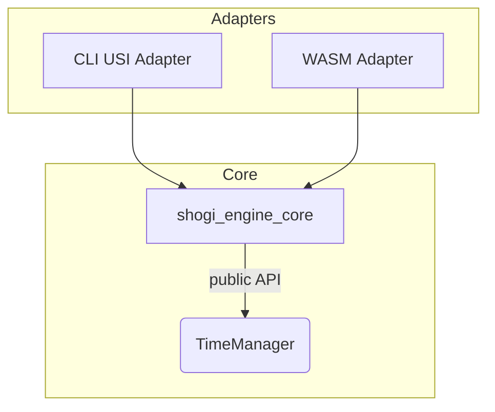

# 将棋エンジン インターフェース & 時間管理 要件書
*版: 2025-07-22 rev2 (Phase‑2)*

---

## 0. 目的

* **2 アダプタ構成** で **最小実装コスト** と **将来拡張性** を両立する  
  1. **CLI アダプタ** … **USI 1.2** を話し、大会サーバや市販 GUI と接続  
  2. **WASM アダプタ** … **JS API / Web Worker** で Web／PWA／Tauri から直接呼び出す  

> **注:** GUI RPC アダプタ（gRPC / WebSocket）は *Phase‑3* で検討。

---

## 1. 全体アーキテクチャ



* **Core (`shogi_engine_core`)** – I/O 非依存の **純粋ライブラリ** (`no_std` ではないが OS 依存を避ける)  
* **Adapters** – プロトコル変換のみを担当する **薄いバイナリ** (`main.rs`)  

---

## 2. Core ライブラリ API （crate `shogi_engine_core`）

| 関数 / 構造体 | 役割 |
|---------------|------|
| `Engine::new(cfg)` | TT サイズ・スレッド数・`TimeManager` 実装を注入 |
| `Engine::set_position(fen, moves)` | 内部 `Position` を設定 |
| `Engine::go(limits) -> SearchHandle` | **キャンセル安全**に反復深化を非同期開始 |
| `SearchHandle::best_move()` | 探索終了までブロックし、PV・統計を返す |
| `Engine::stop()` | 現行探索を停止（`AtomicBool` フラグ） |
| `struct SearchLimits` | USI `time`/`inc` 等をミラー。`builder()` で拡張しやすく |

* すべて **`Send + Sync + 'static`** を満たす  
* ログやプロファイルはアダプタ側で実装可能とする

---

## 3. CLI USI アダプタ （crate `engine_cli`）

| 要件 | 詳細 |
|------|------|
| プロトコル | **USI 1.2** 完全実装：`usi`, `isready`, `setoption`, `usinewgame`, `position`, `go`, `stop`, `ponderhit`, `quit` |
| I/O | `stdin` / `stdout` 行単位 (`flush()` 必須) |
| オプション | `setoption` → Core へ伝播；無効値はエラー |
| 並列 | 探索専用スレッド；メインスレッドはコマンド受信 |
| info 出力 | 深さ更新時 or 1 s 毎のどちらか早い方で `info depth … pv …` |

---

## 4. WASM アダプタ （crate `engine_wasm`）

| 項目 | 要件 |
|------|------|
| ターゲット | `wasm32-unknown-unknown` + **wasm‑bindgen** |
| ビルド | `wasm-pack build -p engine-wasm --target web` |
| JS API | `init() -> Promise<EngineHandle>`<br>`setPosition(fen, moves)`<br>`go(limits, onInfo) -> Promise<BestMove>`<br>`stop()` |
| スレッド | **wasm‑bindgen‑rayon** + Web Workers / `SharedArrayBuffer`<br>環境が非隔離なら自動で 1 thread |
| 時間取得 | JS shim の `performance.now()` を `TimeManager` へ注入 |
| ログ | `onInfo({depth, score, nodes, nps, pv})` を ~200 ms 間隔で呼ぶ |
| デバッグ | `console_error_panic_hook`, `wasm-logger` を組み込み |

---

## 5. 時間管理モジュール （`time_management.rs`）

```rust
pub struct TimeManager;

impl TimeManager {
    pub fn init(&mut self, limits: &SearchLimits, side: Color, ply: u32);
    pub fn should_stop(&self) -> bool;          // 15 ms または 2_048 nodes 毎
    pub fn adjust_by_stability(&mut self, pv_changes: u32);
    pub fn force_stop(&self);
    pub fn finish_move(&mut self);              // remain 更新
}
```

**割り当て計算（暫定式）**

```
base  = (remain / moves_left) + inc * 0.8
factor = 1.2 (序盤) / 1.0 (中盤) / 0.8 (終盤)
hard_max = max(base * 4, 1_000 ms).min(remain * 0.8)
```

* `Arc<AtomicBool>` を全スレッド共有  
* Stop 判定は **メインスレッドのみがタイマ計測**し，他スレッドはフラグ監視

---

## 6. ビルド & 配布

| ターゲット | コマンド | 生成物 |
|------------|----------|--------|
| Core ライブラリ | `cargo build -p shogi_engine_core --release` | `libshogi_engine_core.rlib` |
| CLI USI バイナリ | `cargo build -p engine_cli --release` | `shogi_engine_cli` |
| WASM パッケージ | `wasm-pack build -p engine-wasm --target web` | `pkg/` (`.wasm`, `.js`) |

---

## 7. テストマトリクス

| 種類 | ツール | 合格基準 |
|------|-------|---------|
| 単体: TimeManager | `cargo test -p shogi_engine_core time` | 全アサーション通過 |
| 結合: USI | Shell スクリプト | `isready` 応答 < 200 ms |
| 結合: WASM | `wasm-bindgen-test --headless` | `go` が制限内に指し手返却 |
| ストレス: 並列 | `loom` + `cargo tarpaulin` | データ競合なし、Coverage ≥ 80 % |
| 性能 | `bench_startpos --depth 12` | 1 thread NPS ≥ 1.5 M |

---

## 8. 非目標 (Phase‑2)

* 豪華 GUI / 評価グラフ  
* 自己対局フレームワーク（別クレート予定）  
* クラスタリング・分散探索

---

## 9. 変更履歴

| 日付 | 変更内容 |
|------|---------|
| 2025‑07‑16 | 初版（CLI + GUI RPC） |
| 2025‑07‑22 | **GUI RPC → WASM** へ置換，レビュー反映 |
