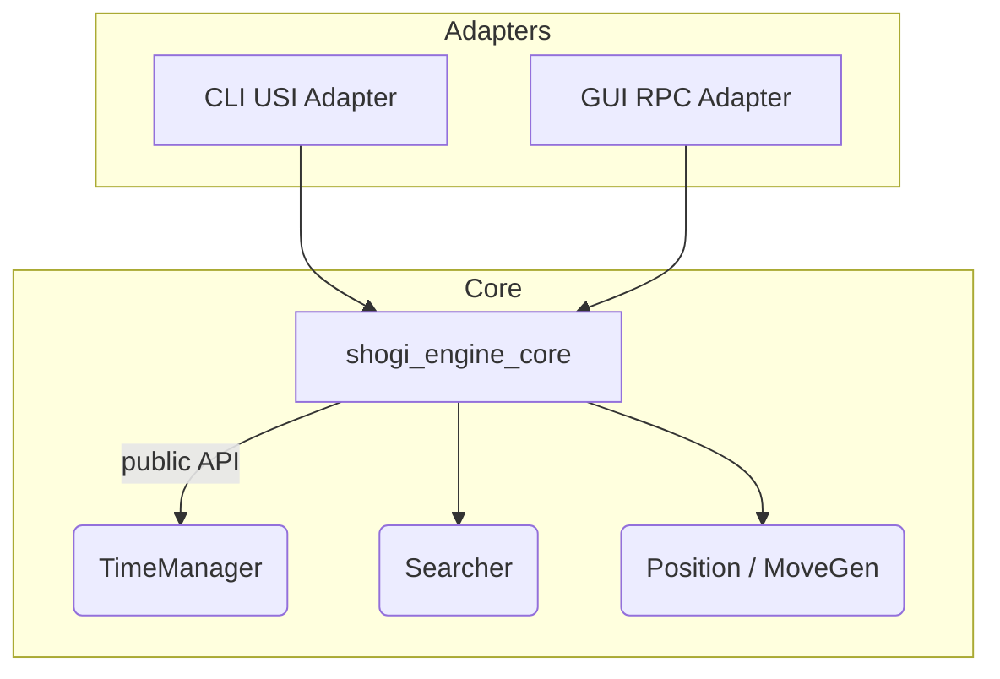

# 将棋エンジン インターフェース & 時間管理 要件書
*版: 2025-07-16*

## 0. 目的
**2 つのアダプタ構成** を採用し、最小限の実装コストで将来の拡張性を確保する。

1. **CLI アダプタ** ― **USI** プロトコルを話し、既存 GUI・ベンチマーク・大会サーバと接続可能にする。  
2. **GUI アダプタ** ― **RPC / WebSocket API** を公開し、独自フロントエンドから柔軟にエンジンを操作できるようにする。

両アダプタは共通の Core ライブラリクレートの上に薄く載せる。

---

## 1. 全体アーキテクチャ



* **Core (`shogi_engine_core`)**  
  I/O やスレッドに依存しない **純粋ライブラリ** とする。  
* **Adapters**  
  プロトコル変換のみを担当する **薄いバイナリ (`main.rs`)**。

---

## 2. Core ライブラリ API（crate `shogi_engine_core`）

| 関数 / 構造体 | 役割 |
|---------------|------|
| `Engine::new(cfg)` | エンジン生成。`TimeManager`・TT サイズ・スレッド数を注入 |
| `Engine::set_position(fen, moves)` | 内部 `Position` を設定 |
| `Engine::go(limit: SearchLimits) -> SearchHandle` | 反復深化を非同期で開始 |
| `SearchHandle::best_move()` | 探索終了までブロックし、PV・統計を返す |
| `Engine::stop()` | 現在の探索を停止 |
| `struct SearchLimits` | USI の制限項目をミラー（`time`, `inc`, `depth`, `nodes`, `movetime`, `infinite`, `ponder`） |

Core は **Send + Sync** とし、アダプタ側で好きなランタイム (`tokio` など) を使えるようにする。

---

## 3. CLI USI アダプタ（crate `shogi_engine_cli`）

| 要件 | 詳細 |
|------|------|
| プロトコル対応 | USI 1.2 を完全実装：`usi`, `isready`, `setoption`, `usinewgame`, `position`, `go ...`, `stop`, `ponderhit`, `quit` |
| I/O | **stdin / stdout** 行単位。毎行 `flush()` |
| オプション | `setoption name Hash size 256` などを Core に反映 |
| 並列 | 探索は専用スレッドで。メインスレッドはコマンド受信 |
| ログ | `info depth ... score ... nodes ... nps ... pv ...` を出力 |

*非目標*: GUI ウィジェットやグラフィック、COOP/COEP 対応など。

---

## 4. GUI RPC アダプタ（crate `shogi_engine_rpc`）

| 項目 | 要件 |
|------|------|
| トランスポート | **gRPC** (バイナリ) **または** **WebSocket + JSON**。feature flag で切替 |
| API 面 | `POST /engine/new` → engine_id 取得<br>`POST /engine/{id}/position`<br>`POST /engine/{id}/go` (ストリームで PV 更新)<br>`POST /engine/{id}/stop`<br>`DELETE /engine/{id}` |
| ストリーミング | 200 ms ごとに `depth`, `seldepth`, `pv`, `nps`, `nodes` を送信 |
| バージョニング | `/v1` 名前空間、ハンドシェイクにセマンティックバージョン |
| 認証 (将来) | トークンヘッダを受け取れるようにしておく（初期実装では任意） |

---

## 5. 時間管理モジュール（`time_management.rs`）

### 5.1 公開 API
```rust
pub struct TimeManager;
impl TimeManager {
    pub fn init(&mut self, limits: &SearchLimits, side: Color, ply: u32);
    pub fn should_stop(&self) -> bool;
    pub fn adjust_by_stability(&mut self, pv_changes: u32);
    pub fn force_stop(&self);
    pub fn finish_move(&mut self); // 残り時間を更新
}
```

### 5.2 最低限の動作仕様
1. **入力マッピング**  
   – USI の各時間パラメータと RPC JSON を同じ構造体に取り込む。  
2. **割り当て計算 (Lv‑2: フェーズ対応)**  
   - `base = (remain / moves_left) + inc*0.8`  
   - `factor = 1.2` (序盤) / `1.0` (中盤) / `0.8` (終盤)  
   - オーバーヘッド 50 ms を引く  
   - `hard_max = min(remain*0.8 , base*6)`  
3. **停止判定頻度**  
   - 2048 ノード毎 または 15 ms 毎に `should_stop()` を呼ぶ  
4. **スレッド安全**  
   - 全スレッド共通で `Arc<AtomicBool>` のストップフラグを使用  

---

## 6. ビルド & 配布

| ターゲット | コマンド | 生成物 |
|------------|----------|--------|
| Core ライブラリ | `cargo build -p shogi_engine_core --release` | `libshogi_engine_core.rlib` |
| CLI USI バイナリ | `cargo build -p shogi_engine_cli --release` | `shogi_engine_cli` |
| GUI RPC バイナリ | `cargo build -p shogi_engine_rpc --release --features ws` | `shogi_engine_rpc` |
| WASM (任意) | `wasm-pack build -p shogi_engine_core --target web` | `pkg/engine_core_bg.wasm` |

---

## 7. テストマトリクス

| テスト | ツール | 合格基準 |
|--------|-------|---------|
| 単体: TimeManager | `cargo test -p shogi_engine_core time` | 全アサーション通過 |
| 結合: USI | スクリプト stdin/stdout | `isready` 応答 < 200 ms |
| 結合: RPC | `pytest + httpx` | `/go` が制限内に指し手返却 |
| ストレス: マルチコア | `loom` + `cargo tarpaulin` | データ競合なし、Coverage ≥ 80 % |
| 性能 | `bench_startpos --depth 12` | 1 スレッド NPS ≥ 1.5 M |

---

## 8. 非目標 (Phase 3 では扱わない)

* 豪華な GUI 描画や評価グラフ  
* 自己対局フレームワーク（別クレートで提供予定）  
* クラウド分散探索・クラスタリング

---

## 9. 変更履歴

| 日付 | 変更内容 |
|------|---------|
| 2025-07-16 | 2 アダプタ構成を前提とした初版作成 |
