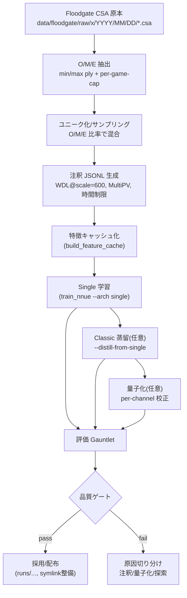

# NNUE学習 入門ガイド（このリポジトリの実例）

このガイドは「FloodgateのCSA棋譜 → 局面抽出 → 注釈（教師生成）→ 特徴キャッシュ → 学習（Single）→ 蒸留（Classic）→ 量子化 → 評価（Gauntlet）」まで、実運用中の手順を初学者向けにやさしく説明します。実際に使われているスクリプト・既定値・成果物パスを交え、再現できる最短ルートを示します。

> 重要: 評価時は threads=1 固定（Spec 013）。固定オープニングを使って回帰を取り、PV不足は補助ツールで採取します。

---

## 全体像（フロー）



---

## 前提と用語
- Floodgate: 東大wdoorの対局ログ（CSA）。本リポジトリでは `data/floodgate/raw/x` に配置済み（古い〜最新まで混在）。
- O/M/E: 序盤(Opening) / 中盤(Middlegame) / 終盤(Endgame)。手数レンジで粗く分けてバランス良く学習します。
- JSONL: 1行1局面の教師データ（WDLまたはcp）。
- キャッシュ: 学習時I/Oを減らすための特徴量ファイル。
- Single/Classic: NNUEの2つの構成。Singleは「精度重視の大きめモデル（主にFP32, 教師用途）」、Classicは「対局配布・速度重視の軽量モデル（量子化と相性が良い）」という位置づけです。
- Gauntlet: ベースvs候補を固定条件で対戦させる評価。勝率/NPSをゲートに使います。

### Single と Classic の違い（丁寧めの説明）
- 目的の違い
  - Single: 学習時の到達精度や安定した教師出力を重視。大きめのパラメータ数で表現力が高い。
  - Classic: 実行時（対局・配布時）の速度とメモリ効率を重視。小さめで軽く、量子化（int8等）でさらに高速化しやすい。
- 実行速度/NPS
  - 一般に Classic の方が同一ハードウェア・同条件で高速（NPSが高い）です。理由は「ファイルサイズ」ではなく「演算量（パラメータ数と積和回数）」が小さいためです。
- ファイルサイズ（例: このリポジトリの成果物）
  - Single FP32: 約180MB前後（`runs/.../single_v1/nn_best.fp32.bin`）。
  - Classic v1（エクスポート形式）: 約90MB前後（`.../classic_v1/nn.classic.nnue`）。
  - 数値は構成・層幅によって変わりますが、傾向として Single > Classic です。
- 作り方（本リポジトリの標準パイプライン）
  1) まず Single（FP32, 教師）を学習する。
  2) Single の出力（勝率ロジット）を教師にして Classic を「蒸留（distillation）」で学習する。
  3) 必要に応じて Classic を量子化（per‑channel 校正など）して実行速度をさらに上げる。

注意: 「Singleを量子化するとClassicになる」という意味ではありません。Singleを量子化しても“量子化Single”であり、Classicの構造にはなりません。本リポジトリでは「Single→（蒸留）→Classic→（量子化）→配布・評価」という流れを推奨しています。

---

## ステップ1: データ（CSA）を用意する
- ローカルの原本は `data/floodgate/raw/x/YYYY/MM/DD/*.csa` に格納します。
- 取得ツール（参考）: `floodgate_pipeline` の `fetch-index`/`download` サブコマンド（ネットワーク環境がある場合）。

```bash
# 参考: インデックス取得とダウンロード（HTTPのみ）
cargo run -p tools --release --bin floodgate_pipeline -- \
  fetch-index --out runs/00LIST.floodgate

cargo run -p tools --release --bin floodgate_pipeline -- \
  download --index runs/00LIST.floodgate --out-dir data/floodgate/raw/x
```

> 既に `data/floodgate/raw/x` にある場合はこの手順は不要です。

---

## ステップ2: O/M/E 抽出 → ユニーク → サンプリング
- スクリプト一発で実行できます（下の「最短レシピ」参照）。内部では以下を行います。
  - 抽出（SFEN化）: 序盤1–20手, 中盤21–120手, 終盤121–400手。1対局あたりの採用上限あり（O/M/E=40/60/20）。
  - ユニーク化: 文字列で重複除去。
  - サンプリング: 目標ユニーク数に到達するよう O/M/E 比率（既定 0.40/0.50/0.10）で抽出。

代表コマンド（内部動作）:
```bash
# 抽出（例: 序盤）
cargo run -p tools --release --bin floodgate_pipeline -- \
  extract --root data/floodgate/raw/x --out runs/phase1/open.sfens \
  --mode all --min-ply 1 --max-ply 20 --per-game-cap 40

# ユニーク化（例）
LC_ALL=C sort -u runs/phase1/open.sfens -o runs/phase1/open.unique.sfens
```

> 比率/上限はデータ偏りを抑えるための安全策です。戦型や終局付近を厚めにしたい場合は環境変数で変更できます。

---

## ステップ3: 注釈（教師データ JSONL を作る）
- 推奨設定（既定）: ラベル=WDL、`--wdl-scale 600`、`--multipv 2`、`--time-limit-ms 200～300`。
- 近締切の設計（P0/P1）は既定ONで空PV率≈0%を狙います（探索の安定化）。

```bash
cargo run -p tools --release --bin generate_nnue_training_data -- \
  runs/phase1/train.sfenl runs/phase1/train.jsonl \
  3 256 0 --engine enhanced \
  --label wdl --wdl-scale 600 --multipv 2 \
  --time-limit-ms 250 --jobs 32 --split 200000 \
  --reuse-tt --hash-mb 256 --output-format jsonl \
  --structured-log runs/phase1/train.manifest.json
```

Tips:
- 終盤だけ時間延長したい→ `TIME_MS_END` を使い、Open+MidとEndを別注釈して最後に結合できます。
- 進捗・成功率・エラー内訳は `*.manifest.json` を参照。

### 注釈の中身（何をしている？）
- 与えられた局面（SFEN）をエンジンで探索し、Top1のPVと評価（WDLまたはcp）を求めます。
- 得られた結果から「教師ラベル（teacher）」を作り、探索メタ情報とともに1行=1局面のJSONLに記録します。

### 採用条件（成功とみなす基準）
- Top1（`lines[0]`）の境界が `Exact` であること（下界/上界ではない）。
- PVが空でないこと（空PVは不採用）。
- 時間・探索上限内で完了していること（時間超過はスキップ）。

### 失敗・スキップの代表例（manifestに集計）
- `empty_or_missing_pv`: PVが取得できなかった。
- `nonexact_top1`: Top1が `Exact` でない（`LowerBound`/`UpperBound`）。
- `time_overrun`: 探索が時間上限×係数を超過。

### JSONL の最小スキーマ例
```json
{
  "sfen": "lnsgkgsnl/1r5b1/ppppppppp/9/9/9/PPPPPPPPP/1B5R1/LNSGKGSNL b - 1",
  "ply": 18,
  "stm": "b",
  "teacher": { "domain": "wdl-logit", "p": 0.63 },
  "eval": 124,
  "depth": 20,
  "nodes": 1500000,
  "time_ms": 250,
  "pv": ["7g7f", "3c3d"],
  "source": { "kind": "floodgate", "ts": "2025-03-30T09:00:06Z" }
}
```

### そのほかのポイント
- ラベル種別: `--label wdl` または `--label cp`。WDL時は内部でロジットzを用い、cpとの変換に `--wdl-scale`（既定600）を使います（補足章参照）。
- MultiPV: `--multipv` で複数主候補を探索します。ラベルとしてはTop1（最良手）のみ採用しますが、Top2/Top3は「曖昧さ検出」や指標計算に使います（下記参照）。
- メタ情報: `depth/seldepth/nodes/time_ms/bound` 等を併記し、後段の分析・品質監視に利用します。

#### Q: `generate_nnue_training_data` は NNUEファイルを使いますか？
- 既定では使いません。`--engine enhanced`（または `material`）は学習済みNNUE重みを必要としません。
- NNUE重みを使うのは `--engine nnue` または `--engine enhanced-nnue` を選び、`--nnue-weights <path>` を与えた場合です。
- 実運用（Phase1の既定）は一貫性のため `--engine enhanced` を使用しています。再注釈や実験で教師を強めたい場合に限り、`--engine nnue --nnue-weights runs/.../single_v1/nn_best.fp32.bin` のように指定します。

#### Q: 継続学習（ラウンド2以降）でも `--engine enhanced` を使うべき？
- はい（既定）。継続学習でも注釈は `--engine enhanced` を基本にします。理由は次のとおりです。
  - ラベルの一貫性: ラベル分布（cp↔WDL変換や探索設計）が揃い、過去ラウンドとの比較・回帰が取りやすい。
  - フィードバック抑制: 自身のNNUEで注釈すると自己強化バイアスが入りやすい。教師は学習ループ外（enhanced）に置くのが安全。
  - 運用の単純化: 生成・検証・量子化・評価の各工程で基準が固定される。
- 例外（任意の拡張）
  - 曖昧局面のスポット再注釈: `orchestrate_ambiguous` で MultiPVや時間を増やし、必要に応じ `--engine nnue --nnue-weights <Single>` を使って“難所”だけ強い教師で上書き。
  - 研究目的の全面再注釈: 新しい教師方針に切り替える場合は、manifestに教師の種別/ハッシュを必ず記録し、val基準で差分検証してから採用。
  - Classic 学習は「蒸留」で対応: `train_nnue --distill-from-single` が教師利用の正道で、`generate_nnue_training_data` をNNUEで置き換える必要はありません。

### なぜ MultiPV を使うの？（Top1しか採用しないのに）
MultiPV は“教師ラベルを増やす”ためではなく、「品質を監視・補助するため」に使います。

- 曖昧さ（ambiguous）検出
  - Top1 と Top2 の評価差 `best2_gap_cp` が小さい局面は、時間不足や窓設定の影響でラベルがブレやすい“曖昧局面”。
  - これらは `orchestrate_ambiguous` で抽出し、条件付きで MultiPV=3 に再探索してエントロピーを計算→再注釈します。
- 指標とフィルタリング
  - JSONLに `best2_gap_cp` や `softmax_entropy_k3` メタを付け、後段で重み付け・再注釈・除外の判断材料にします。
- 安定性の補助
  - 代替手の探索により、アスピレーション失敗や一本化による外れ値の検知がしやすくなります（時間は分散するため、MultiPVは2〜3程度が現実的）。

注意: MultiPV を上げると1局面あたりの探索コストが増えます。既定は 2〜3 とし、終盤だけ増やす等の運用を推奨します。

### bound（境界）とは？
探索の最終スコアが「厳密値」か「境界値」かを示すフラグです。アルファベータ探索では、窓外にスコアが出ると“境界”になります。

- `Exact`: 厳密値（採用条件）。
- `LowerBound`: これ以上（fail-high）。実際の値は表示値以上。
- `UpperBound`: これ以下（fail-low）。実際の値は表示値以下。

本パイプラインでは「Top1 が `Exact` である」局面のみを教師として採用します。`Lower/UpperBound` は時間不足や窓の外れで値が不安定なため、JSONLには入れず manifest に `nonexact_top1` 等として記録します。


---

## ステップ4: 特徴キャッシュを作る
```bash
cargo run -p tools --release --bin build_feature_cache -- \
  -i runs/phase1/train.jsonl -o runs/phase1/train.cache \
  -l wdl --compress --compressor gz --compress-level 6 \
  --io-buf-mb 8 --metrics-interval 20000 --report-rss
```

> zstdを使う場合は `--features zstd` でビルドし、`--compressor zst` を選びます。

---

## 補足: WDL と `--wdl-scale 600` の意味

このリポジトリでは、注釈ラベルに「WDL（勝率）」を用いる設定が既定です。内部的には、ネットワークが出力する値は勝率の「ロジット（σ前の実数）」で、次の関係を使って勝率に変換します。

- 勝率 p とロジット z の関係: `p = 1 / (1 + exp(-z))`（シグモイド）
- `--wdl-scale 600` は「cp（センチポーン）とロジット z を相互変換するための係数」です。
  - cp → ロジット: `z = cp / 600`
  - ロジット → cp: `cp ≈ z * 600`

直感的には「評価値+600cp は勝率ロジット+1.0に相当」というスケール取りです。学習・蒸留で `wdl` ラベルや `wdl-logit` ドメインを扱う場面では、このスケールで cp と勝率ロジットを行き来させ、混合損失や教師値の整合を保っています。詳細設計は `docs/distillation/teacher_value_domain.md` を参照してください。

---

## ステップ5: 学習（Single）
- ストリーミング学習（`--stream-cache`）でI/Oボトルネックを避けます。
- バリデーションキャッシュを併用すると収束確認が容易です（`runs/fixed/20251011/val.cache` が同梱）。

```bash
cargo run -p tools --release --bin train_nnue -- \
  --input runs/phase1/train.cache --validation runs/fixed/20251011/val.cache \
  --arch single --epochs 1 --batch-size 16384 \
  --lr 1e-3 --metrics --seed 42 \
  --stream-cache --prefetch-batches 4 --throughput-interval 2.0 \
  --out runs/phase1/single_v1
```

成果物: `runs/phase1/single_v1/nn_best.fp32.bin`

---

## ステップ6: 蒸留（Classic, 任意）
- 配布/速度向けにClassicへ蒸留。教師はSingleの出力（WDL-logitドメイン）を使用します。

```bash
cargo run -p tools --release --bin train_nnue -- \
  --input runs/phase1/train.cache --validation runs/fixed/20251011/val.cache \
  --arch classic --distill-from-single runs/phase1/single_v1/nn.fp32.bin \
  --teacher-domain wdl-logit --teacher-scale-fit linear \
  --epochs 1 --batch-size 16384 --lr 8e-4 \
  --export-format classic-v1 --metrics --seed 42 \
  --out runs/phase1/classic_v1
```

成果物: `nn.classic.nnue`（量子化前FP32換算の精度を持つClassic重み）

---

## ステップ7: 量子化（任意）
- per‑channel固定量子化（校正サンプル ≈10万〜12万）でNPS向上と精度維持のバランスを狙います。

```bash
cargo run -p tools --release --bin train_nnue -- \
  --input runs/phase1/train.cache \
  --arch classic --distill-from-classic runs/phase1/classic_v1/nn_best.fp32.bin \
  --distill-only --export-format classic-v1 \
  --quant-calibration runs/fixed/20251011/val.cache runs/phase1/train.cache \
  --quant-calibration-limit 120000 \
  --quant-ft per-tensor --quant-h1 per-channel --quant-h2 per-channel --quant-out per-tensor \
  --out runs/phase1/classic_v1_q_pc
```

成果物: `runs/phase1/classic_v1_q_pc/nn.classic.nnue`

---

## ステップ8: 評価（Gauntlet）とPV補助
- スクリプト `scripts/nnue/evaluate-nnue.sh` を使います。threads=1固定、固定ブック（`runs/fixed/20251011/openings_ply1_20_v1.sfen`）。
- `pv_probe` によるPV補助採取は、内部でサンプルが取れなかったときに自動実行されます。

```bash
# 短TC2000局でローカル評価（例）
./scripts/nnue/evaluate-nnue.sh \
  BASE CAND 2000 1 1000
```

代表的なゲート基準（運用既定）:
- 短TC（0/10+0.1, 2000局, threads=1）: 勝率≥55%、|ΔNPS|≤3%（±5%は要追試）
- 長TC（0/40+0.4, 800→2000局）: 勝率≥55%（ΔNPSは参考）

---

## 最短レシピ（ワンコマンド）
- 収集〜学習（Single）までを一括で回すバッチです。必要に応じて `TARGET_UNIQ` や時間、MPVを調整してください。

```bash
# 例: 目標ユニーク150万, TIME=400ms, MPV=3, Classic蒸留あり
env TARGET_UNIQ=1500000 TIME_MS=400 MULTIPV=3 DO_CLASSIC=1 \
    scripts/nnue/phase1_batch.sh runs/phase1_$(date +%Y%m%d_%H%M) data/floodgate/raw/x
```

---

## よくあるつまずきと対処
- 空PVが多い/成功率が低い
  - 時間延長だけでなく、探索側の安定化（既定P0/P1）を確認。`docs/nnue-annotation-ops.md` を参照。
- データ偏り（特定の年・終盤率が少ない）
  - O/M/E 比率や per-game-cap を調整。必要なら年代フィルタを抽出段に追加。
- 量子化で勝率が落ちた
  - 校正サンプル数・per-channel設定を見直し、FP32とのラウンドトリップ差を `verify_classic_roundtrip` で確認。

---

## どのステップが「既存の学習ファイル」を使う？（早見表）

ここでいう「既存の学習ファイル」とは、過去に学習済みの NNUE 重み（Single/Classic/量子化済み）を指します。

- 使わない（データ起点の処理）
  - Floodgate 取得/抽出（O/M/E）: データのみ。
  - ユニーク化/サンプリング: データのみ。
  - 注釈（JSONL生成）: 既定では `--engine enhanced` を用い、学習済み重みを使いません（オプションで `--engine nnue`＋`--nnue-weights` は可）。
  - 特徴キャッシュ化: データのみ。
  - Single 学習（初回）: ランダム初期化（事前学習重みは不要）。

- 使う（既存モデルを参照する処理）
  - Classic 蒸留: 教師として Single の学習済み重みを使用（例: `runs/.../single_v1/nn_best.fp32.bin`）。
  - 量子化（Classic）: Classic の FP32 重みを量子化（例: `runs/.../classic_v1/nn_best.fp32.bin` → `classic_v1_q_pc/nn.classic.nnue`）。校正にはキャッシュ（`val.cache` など）を使いますが、これは学習“データ”であって学習“重み”ではありません。
  - 評価（Gauntlet/pv_probe）: Baseline/Candidate の重みファイルを指定して対戦・指標採取。

- 条件付きで使う
  - 曖昧局面の再注釈（`orchestrate_ambiguous`）: 既定は `enhanced` ですが、`--nnue-weights` を渡せば学習済みNNUEを使った再探索が可能。

補足: バリデーションキャッシュ（`runs/fixed/20251011/val.cache`）は「検証データ」であり、学習済み“重み”ではありません。学習・蒸留・量子化の評価や校正に使います。

---

## 外部USIエンジンを“教師”として使うには？

`generate_nnue_training_data` は本リポジトリ内蔵エンジン（material/enhanced/nnue/ennue）専用です。外部の強い将棋エンジン（USI）を教師として使う場合は、USIドライバ `label_with_usi_teacher` を使って JSONL に教師値を付与します。

ステップ（最小例）
1) SFEN → 最小JSONLに変換
```bash
awk -v q='"' '{print "{" q "sfen" q ":" q $0 q "}"}' \
  runs/phase1/train.sfens > runs/teacher_ext/min.jsonl
```

2) 外部エンジンで注釈（USI）
```bash
cargo run -p tools --release --bin label_with_usi_teacher -- \
  --engine /path/to/engine \
  --nn /path/to/nnue_or_model.bin \
  --in runs/teacher_ext/min.jsonl \
  --out runs/teacher_ext/out.jsonl \
  --movetime 250 --threads 1 --hash-mb 256 --multipv 2 \
  --write eval --log runs/teacher_ext/log.jsonl
```
- `--write eval` は `eval` フィールド（cp）を書き、後段の `build_feature_cache` がそのまま利用できます。
- エンジンごとのNN指定オプション名（`EvalFile`/`NNUEFile`等）は自動検出しますが、必要なら `--nn-option` で明示可能。

3) キャッシュ化→学習
```bash
cargo run -p tools --release --bin build_feature_cache -- \
  -i runs/teacher_ext/out.jsonl -o runs/teacher_ext/out.cache \
  -l wdl --scale 600 --compress --compressor gz

cargo run -p tools --release --bin train_nnue -- \
  --input runs/teacher_ext/out.cache --arch single --epochs 1 --batch-size 16384 \
  --lr 1e-3 --metrics --seed 42 --stream-cache --out runs/phaseX/single_v1
```

Tips
- `Exact` のみ採用したい場合は、ログを確認しつつ `multipv`, `movetime`/`nodes` を調整してください。必要なら `jq` で `teacher_bound`=="exact" の行だけをフィルタし、`bound1/bound2` にコピーして `BOTH_EXACT` フラグを立てられます。
- 既存パイプラインと混ぜる場合は、manifestに「教師の種類（外部USI/バージョン/ハッシュ）」を必ず残し、品質比較を容易にしてください。

---

## 参考と所在

- 評価ガイド: `docs/nnue-evaluation-guide.md`
- 注釈運用: `docs/nnue-annotation-ops.md`, `docs/nnue-generator-faq.md`
- 実施ログ: `docs/reports/nnue-training-log.md`
- 固定バリデーション/ブック: `runs/fixed/20251011/*`
- 一括バッチ: `scripts/nnue/phase1_batch.sh`

---

## 用語ミニ辞典
- WDL: 勝ち/引き分け/負けの確率表現（このガイドではロジット空間で扱う設定）。
- MultiPV: 複数主候補。多様性確保や安定化に寄与（学習では2〜3を使用）。
- TT: 置換表（探索の再利用キャッシュ）。`--reuse-tt` で注釈効率を上げます。
- NPS: 1秒あたり探索ノード数。評価の速度指標。

> まずは「最短レシピ」で1周回し、`runs/phase1/...` に成果物ができることを確認しましょう。その後、注釈時間や比率、蒸留・量子化の設定を少しずつ変えて、勝率とNPSのトレードオフを掴むのがおすすめです。

---

## FAQ: なぜ最初から Classic を学習しないの？

結論: 直接 Classic を学習することも可能ですが、多くの場合「Single → Classic へ蒸留」ルートの方が最終品質と運用面で有利です。

明確なメリット（Single→Classic の利点）
- 精度上限（教師の質）
  - 容量と表現力に余裕がある Single は、同じデータ量・同じ注釈条件でも高い到達精度になりやすく、Classic の良い“教師”になります。
- 収束の安定性（ノイズ平滑化）
  - 検索由来の硬いラベル（WDL/cp）だけで Classic を学習するよりも、Single の連続的なロジット（soft target）を混ぜる方が損失スケールが安定し、学習がブレにくいケースが多いです（知識蒸留の利点）。
- 設計探索の自由度
  - いったん強い Single を用意すれば、Classic 側で層幅や量子化方式を変えても、毎回データ生成からやり直さずに蒸留だけで比較検証しやすくなります。
- 表示/スケール整合の取りやすさ
  - `--teacher-domain wdl-logit` と `--teacher-scale-fit linear` を組み合わせて cp⇔勝率ロジットのスケール整合を取りやすく、評価値の安定化（cp表示やWDLの一貫性）に寄与します。
- 量子化の影響切り分け
  - FP32 Single/Classic を基準に先に精度を固め、あとから Classic 量子化の誤差（NPS/勝率への影響）を独立に検証できます。

Classic 直学習を選ぶ場合の注意
- 小型ゆえに表現力が限られ、同じデータ・同じエポックでは到達精度が低めになりがちです。エポック増・正則化・ラベル設計の工夫が必要です。
- 量子化前提の学習は実装・ハイパラが難しく、最終的に蒸留ルートより手戻りが増えることがあります。

まとめ
- 「最終的に配布・実行で使うのは Classic、しかし品質の“山を作る”のは Single、Classic はその山を蒸留で下ろして軽くする」という役割分担が実務では効率的です。
