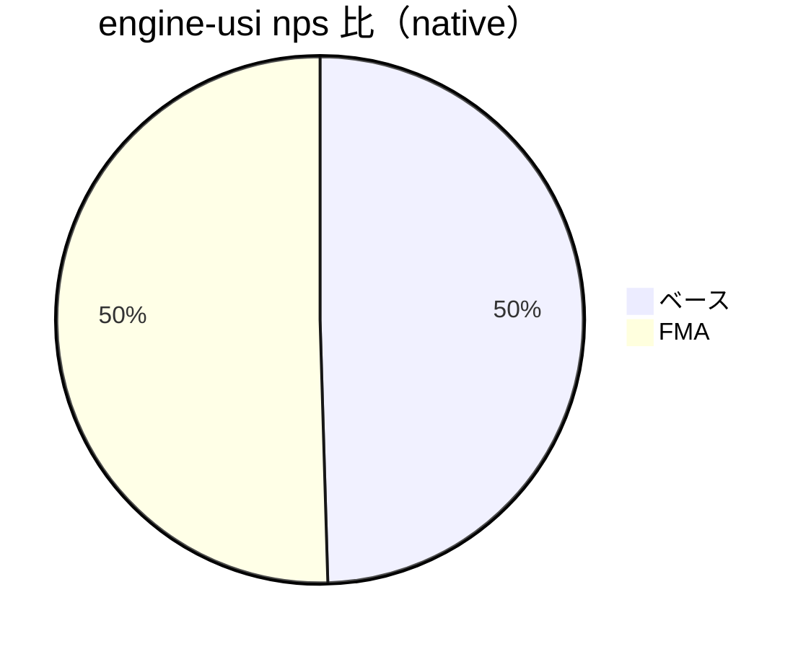

# NNUE fp32 SIMD 実測レポート（dispatcher 統合後）

本書は、`engine-core::simd::add_row_scaled_f32`（fp32 行加算）の SIMD 化・dispatcher 統合に関する実測結果と所見をまとめます。実装計画は `docs/nnue_single_simd_dispatch_plan.md` を参照してください。

## 測定環境（共通）
- ビルド: `cargo build --release` / `cargo bench`（bench プロファイル）
- 推奨: `RUSTFLAGS="-C target-cpu=native"`
- CPU/OS: 同一マシン（詳細割愛）
- 計測対象: 
  - Micro: `crates/engine-core/benches/nnue_add_row_bench.rs`
  - Macro: `cargo run -p engine-usi --release`（USI: movetime=3000ms, Threads=1, EngineType=EnhancedNnue, SINGLE weights）
  - WASM: `crates/engine-wasm`（wasm-pack, Node.js / Web）

## Micro: 行加算ベンチ（criterion）
- コマンド例
  - `RUSTFLAGS="-C target-cpu=native" cargo bench -p engine-core --bench nnue_add_row_bench`
  - `RUSTFLAGS="-C target-cpu=native" cargo bench -p engine-core --bench nnue_add_row_bench --features nnue_fast_fma`
- 代表結果（len=2048, k=0.75, cloneあり/参考）
  - dispatcher: 約 464–485 ns/iter
  - scalar    : 約 167–182 ns/iter
- 所見
  - `-C target-cpu=native` により scalar 側が LLVM の自動ベクトル化（AVX2 以上）で極めて強く、ランタイムディスパッチ（SSE2/AVX）より高速なケースが多い。
  - FMA（`nnue_fast_fma`）は k≠±1.0 経路で有効（hotloop 参考で +5〜8%）。k=±1.0 は add/sub 専用経路のため影響なし。
- 純粋なカーネル比較には「コピー無し・複数回呼び出し＋観測」をより厳密に設計した専用ベンチが有効（今後の改善余地）。

CSV（抜粋）
```
size,k,dispatcher_ns,scalar_ns
2048,0.75,475,175
256,0.75,83,41
```

Mermaid（参考可視化）
```mermaid
bar
    title Native micro len=2048 k=0.75（ns/iter, 小さいほど良）
    x-axis Dispatcher, Scalar
    y-axis ns 0 --> 500
    series 実測 [475, 175]
```

## Macro: engine-usi 実測（movetime=3000ms, 単スレ）
- ネイティブ最適化（`-C target-cpu=native`）
  - 代表ログ: depth 6, time ≈101ms, nodes 199,607, nps ≈1,976,306（1回例）
  - 3回平均（nps）
    - ベース: ≈ 1,959,262 nps
    - FMA有: ≈ 1,996,465 nps（+1.9%）
- Generic 条件（`RUSTFLAGS="-C target-feature=-avx,-avx2,-fma -C target-cpu=x86-64"`）
  - 3回平均（nps）
    - ベース: ≈ 1,756,912 nps
    - FMA有: ≈ 1,746,395 nps（差は誤差〜微減）
- 所見
  - Macro 指標では FMA の影響は 1〜2% 程度（局面/時間で変動）。
  - Generic では nps 全体が低下。FMA 経路は target_feature 関数内でのみ有効だが、ここでは有意差が目立たず。

CSV（3回平均, nps）
```
mode,avg_nps
native_base,1959262
native_fma,1996465
generic_base,1756912
generic_fma,1746395
```

Mermaid（速度比: native_fma / native_base）


## WASM（wasm32, simd128）
- Node.js（wasm-pack --target nodejs, len=256, reps=500,000）
  - SIMD:  k=1 → 14ms, k=-1 → 13ms, k=0.75 → 19ms
  - NOSIMD: k=1 → 81ms, k=-1 → 35ms, k=0.75 → 42ms
  - 速度比（NOSIMD/SIMD）: k=1 ≈ 5.8x, k=-1 ≈ 2.7x, k=0.75 ≈ 2.2x
- ブラウザ（target web）でも simd128 対応環境で同等傾向を期待（詳細: `docs/wasm_simd_bench.md`）。

CSV（Node, ms）
```
build,k,ms
simd,1.0,14
simd,-1.0,13
simd,0.75,19
nosimd,1.0,81
nosimd,-1.0,35
nosimd,0.75,42
```

Mermaid（参考可視化: ms/500k reps, 小さいほど良）
```mermaid
bar
    title WASM Node len=256 reps=500k（ms, 小さいほど良）
    x-axis simd-k1, simd-k-1, simd-k0.75, nosimd-k1, nosimd-k-1, nosimd-k0.75
    y-axis ms 0 --> 90
    series 実測 [14, 13, 19, 81, 35, 42]
```

## 総括・推奨
- ランタイムディスパッチ（AVX/FMA/SSE2）
  - 目的は配布互換性と可搬性の確保。ネイティブビルドの scalar 自動ベクトル化と単純比較すると不利なケースがあるが、generic 配布で幅広い CPU に対して最適経路を提供できる価値が高い。
  - `OnceLock<fn>` で検出コストは初回のみ。`k=±1.0` 専用経路の導入は有効。
- FMA（`nnue_fast_fma`）
  - k≠±1.0 経路で有効（Micro: +5–8% 目安、Macro: +1〜2% 程度）。再現性重視時は OFF 運用可。
- WASM（simd128）
  - 明確なメリットあり。特に k=±1.0 の add/sub 経路で効果が大きい。配布は SIMD/非SIMD の 2 バンドル戦略を推奨。

## 参考
- ビルド/ブラウザ計測手順: `docs/wasm_simd_bench.md`
- 実装計画: `docs/nnue_single_simd_dispatch_plan.md`

## CI 収集スクリプト（提案）
レポート生成を自動化するためのスクリプトを用意しています。

- `scripts/collect_nnue_fp32_simd_metrics.sh`
  - 機能:
    - engine-usi（native/generic, ベース/FMA）を各3回測定し、平均 nps を CSV 出力
    - engine-wasm（Node, simd/nosimd）を測定（Node が利用可の場合）
    - engine-core micro（criterion）のログから代表値を抽出（任意）
  - 実行例（ネイティブ最適化前提）:
    ```bash
    bash scripts/collect_nnue_fp32_simd_metrics.sh \
      --macro-native --macro-generic --wasm-node \
      --out docs/performance/data
    ```
  - 出力:
    - `docs/performance/data/engine_usi_native.csv`
    - `docs/performance/data/engine_usi_generic.csv`
    - `docs/performance/data/wasm_node.csv`
    - `docs/performance/data/micro_native.csv`（任意）

CI では、上記 CSV をアーティファクトとして保存し、必要に応じグラフ生成ステップ（Mermaid 対応のレポート合成）を追加してください。
