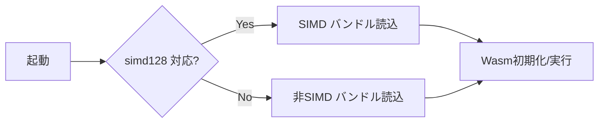

# WASM SIMD ベンチ（fp32 行加算）

本ドキュメントは、`engine-core::simd::add_row_scaled_f32` を WebAssembly (wasm32) で計測する手順です。simd128 有効/無効の比較を行い、ブラウザ上での効果を確認します。

## 前提
- 最新ブラウザ（Chrome/Firefox/Safari/Edge）
- Rust 工具一式 + wasm-pack

## ビルド

- simd128 有効ビルド（推奨）
```bash
RUSTFLAGS="-C target-feature=+simd128" \
wasm-pack build crates/engine-wasm --release --target web
```

- フォールバック（simd128 無効）
```bash
RUSTFLAGS="-C target-feature=-simd128" \
wasm-pack build crates/engine-wasm --release --target web --out-dir pkg-nosimd
```

実運用では、`wasm-feature-detect`（npm）等でランタイム判定し、simd 対応なら simd 版を、非対応なら nosimd 版を読み込む 2 バンドル戦略が堅実です。

## 簡易ベンチ（ブラウザ）
以下の HTML を任意の静的サーバで配信して実行します（`python -m http.server` 等）。

```html
<!doctype html>
<html>
<meta charset="utf-8">
<body>
<script type="module">
  async function loadWasm(url) {
    const mod = await import(url);
    return mod;
  }
  // simd 対応の場合はこちらを優先
  const simdUrl = './pkg/engine_wasm.js'; // wasm-pack 出力
  // 非対応用（オプション）
  const nosimdUrl = './pkg-nosimd/engine_wasm.js';

  let mod;
  try {
    mod = await loadWasm(simdUrl);
  } catch (e) {
    console.warn('SIMD module failed, try nosimd', e);
    mod = await loadWasm(nosimdUrl);
  }

  const len = 256;
  const reps = 1_000_000; // 繰り返し回数（環境に応じ調整）
  const ks = [1.0, -1.0, 0.75];

  for (const k of ks) {
    const t0 = performance.now();
    const out = mod.bench_add_row_scaled(len, k, reps);
    const t1 = performance.now();
    console.log(`k=${k}: time=${(t1-t0).toFixed(1)}ms, out=${out}`);
  }
</script>
</body>
</html>
```

## 期待される傾向
- k=±1.0 は add/sub の専用経路が効くため、simd128 で明確に高速化（1.3〜2.0倍程度）
- k≠±1.0 は mul+add。simd128 で命令数削減の効果が見込める（1.2〜1.6倍目安）
- 環境（CPU/ブラウザ/電源管理）により差は変動します。`reps` を十分大きくし、ウォームアップ後に測定してください。

## 注意
- Wasm には FMA は無い（mul+add のみ）。本リポジトリの `nnue_fast_fma` は Wasm では意味を持ちません。
- JS↔Wasm の呼び出し回数が多いと性能が落ちます。ホットループは Wasm 内に閉じるように設計してください（本ベンチはその想定）。
- Threads/Atomics を併用した並列化は COOP/COEP/SharedArrayBuffer 要件が必要です。SIMD と併用すると更に向上余地がありますが、配布条件が厳しくなります。

## 設定の優位性（推奨構成と注意点）

### SIMD128（`-C target-feature=+simd128`）
- 優位性: f32 行加算に直撃。k=±1.0 の add/sub 専用経路を含め、レーン並列で有意に高速化。
- 配布: ランタイム検出不可のため 2 バンドル（simd/nosimd）が安全。`wasm-feature-detect` などで切替。

### fast-fma（`nnue_fast_fma`）
- 優位性: Wasm には FMA 命令が無く効果なし（mul+add のみ）。ネイティブ用スイッチとして残す。

### Threads + Atomics（並列化）
- 優位性: マルチコア活用で更なる高速化（SIMD と併用可）。
- 前提: COOP/COEP/SharedArrayBuffer が必要。`-C target-feature=+atomics,+bulk-memory,+mutable-globals` 等の設定が必要。

### wasm-opt（Binaryen）
- 優位性: 速度/サイズ双方に効く（例: `-O3` または `-Oz`）。
- 注意: ツールチェーン依存で不安定な場合は一時無効化し、環境更新後に再有効化を検討。

### LTO/コード生成
- 推奨: `lto="fat"` + `codegen-units=1`（速度）、`panic=abort`（サイズ/オーバーヘッド削減）。
- 注意: ビルド時間増。CI ではキャッシュ活用。

### アロケータ/サイズ
- `wee_alloc` はサイズ削減向き（速度はやや不利）。速度優先ならデフォルトで可。

### API/境界設計
- ホットループは Wasm 内に閉じる（JS↔Wasm 往復を減らす）。
- 大きな配列は「一括」受け渡し。必要なら Wasm メモリを直接操作する設計も検討。

### ターゲット（web / nodejs）
- nodejs: ベンチや CI に最適。simd128 対応の Node を使用。
- web: 本番配布。feature-detect で simd バンドルを選択。

### getrandom（`wasm_js`）
- wasm32 では `getrandom` の `wasm_js` バックエンドを使用し、ブラウザの `crypto.getRandomValues` を利用。

## 推奨プリセット
- 高速重視（最新ブラウザ/PWA）
  - `+simd128`, `lto="fat"`, `codegen-units=1`, `panic=abort`, wasm-opt `-O3`
  - 2 バンドル（simd/nosimd）配布、ホットループは Wasm 内に閉じる
  - 可能なら Threads+Atomics も（配布要件に注意）
- 互換性重視（古い端末あり）
  - 非 simd 版（`-simd128`）, `lto="thin"`, wasm-opt `-Oz`
  - feature-detect で simd 版に誘導可
- Node/CI 用
  - `--target nodejs`, `+simd128`, wasm-opt `-O3`
  - `scripts/collect_nnue_fp32_simd_metrics.sh --wasm-node` で CSV 収集

### バンドル選択フロー（例）


## 実測（Node.js, wasm-pack --target nodejs）
- 条件: len=256, reps=500,000, 同一マシン（Node v22）, `engine-wasm` を simd 版/非 simd 版でビルド
- 測定スクリプト（概略）
  ```bash
  node -e "const simd=require('./crates/engine-wasm/pkg/engine_wasm.js'); \
           const nosimd=require('./crates/engine-wasm/pkg-nosimd/engine_wasm.js'); \
           function run(mod,name,reps){ const len=256; \
             for (const k of [1.0,-1.0,0.75]) { const t0=Date.now(); \
               const out=mod.bench_add_row_scaled(len,k,reps); const t1=Date.now(); \
               console.log(name,'k',k,'reps',reps,'ms',t1-t0,'out',out); } } \
           run(simd,'simd',500000); run(nosimd,'nosimd',500000);"
  ```
- 結果（ms, 小数点以下は省略）
  - simd:  k=1 → 14ms, k=-1 → 13ms, k=0.75 → 19ms
  - nosimd: k=1 → 81ms, k=-1 → 35ms, k=0.75 → 42ms
- 速度比（nosimd/simd の概算）
  - k=1: ≈ 5.8x, k=-1: ≈ 2.7x, k=0.75: ≈ 2.2x

ブラウザ（Web target）でも同等以上の傾向が期待できます。配布時は simd 版/非 simd 版の 2 バンドル戦略を推奨します。
